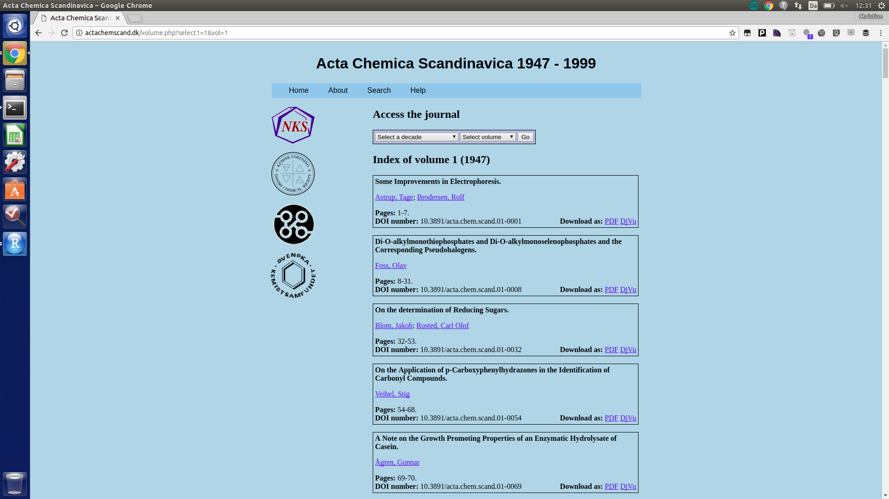
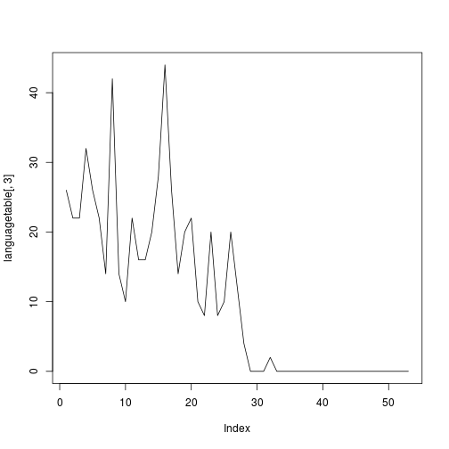
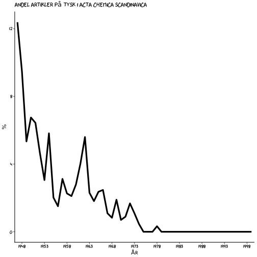

Åbne tidsskrift data
========================================================
author: Christian Knudsen
date: 
autosize: true

Hvorfor er det vigtigt
========================================================

Åbne data giver os mulighed for at besvare spørgsmål vi ellers ikke ville kunne besvare.

Derfor:

* En demonstration af hvordan det egentlig gøres


# dagsordenen: jo ikke kun at demonstrere at vi kan blive klogere
# af at have adgang til data. Men også at vise hvordan processen egentlig er
# Vi har jo ret godt styr på hvordan forskningsprocessen egentlig er, men det her
# er for mange af os en ny facet.


Meget primitivt
========================================================

Et simpelt videnskabshistorisk spørgsmål:

Der var engang hvor tysk var det dominerende sprog i kemien.

Det skiftede til engelsk.

Hvordan så det skift egentlig ud i de nordiske lande?

#Det er ikke noget særligt. Datalab på KUB-Nord assisterer pt. professor Rasmus Bro
# med adgang til ret store mængder data med henblik på at lave maskinlæring på 
# Abstracts på den kemiske litteratur. Det er ret cool, men de er ikke kommet så 
# langt. Og det her er også lidt lettere for almindelige dødelige at forstå.

# Som så mange andre spørgsmål - så er det jo bl.a. bestemt af hvad jeg har adgang
# til af data. Og det er:


Acta Chemica Scandinavica
========================





# Tidsskriftet ligger åbent tilgængeligt.

# Vi har diverse metadata. 

# Primært interessant fordi det hele er helt frit tilgængeligt.

Vi kan høste det hele 
====================

# Jeg springer en del tekniske detaljer over. 

* laver vi en liste over de adresser vi skal hente data fra
* Så henter vi data - og her nøjes vi med årgang og artikeltitler
* så regner vi ud hvilket sprog hver enkelt artikel er skrevet på

Og så ser vi resultatet

Listen med links
===========================================================
Ser således ud.


```
[1] "http://actachemscand.dk/volume.php?vol=1"
[2] "http://actachemscand.dk/volume.php?vol=2"
[3] "http://actachemscand.dk/volume.php?vol=3"
[4] "http://actachemscand.dk/volume.php?vol=4"
[5] "http://actachemscand.dk/volume.php?vol=5"
[6] "http://actachemscand.dk/volume.php?vol=6"
```

* Vi besøger hvert link, og henter data.
* Samtidig beder vi computeren gætte på hvilket sprog artiklen er skrevet på.

Lidt langhåret
===========================


```r
getPaperDetails <- function(paper, volid){
  title <- html_nodes(paper, "b") %>%
    html_text()
  title <- title[1]
  authors <- html_nodes(paper, "p") %>%
    html_text()
  pagesAndDOI <- html_nodes(paper, "div") %>%
    html_text()
  pages <- pagesAndDOI[1]
  pages <- substring(pages, 8, nchar(pages)-1)
  doi <- pagesAndDOI[2]
  doi <- substring(doi, 13, nchar(doi))
  language <- textcat(title)
  year <- acta[which(acta$url_id==volid),]$year
  volume <- acta[which(acta$url_id==volid),]$vol
  url_list <- paper %>% html_nodes("a") %>% html_attr("href")
  urls <- lapply(url_list, function(ch) grep("pdf", url_list))
  url <- url_list[urls[[1]]]
  
  result <- list(title=title, authors=authors, language=language, pages=pages, 
                 doi=doi, volume=volume, year=year, url=url)
}
```

# ja, det er ret langhåret. Men det her er hvad vores brugere ville gøre hvis
# de ville trække den slags metadata fra en af vores ressourcer. Pointen er, at 
# hvis de skal kunne det, skal vi sikre at dataene er tilgængelige.
# Ofte vil vi forsøge at skaffe dem API-adgange. Her er jeg nødt til at høste hver
# enkelt side på tidsskriftets hjemmeside, og pille data ud. Det kan jeg programmere
# mig ud af, og det der tager længst tid er at hente hver enkelt side fra nettet.
# Mere strukturerede adgange ville kunne gøre det hurtigere, men ofte vil brugerne
# under alle omstændigheder skulle gøre denne type af ting for at få fingre i data.

Læring?
=====================================
Hvis ikke vi sikrer adgang til metadata på ressourcerne - skal vores brugere gøre arbejdet.

En fin tabel
================================


```
                            authors language year
1     Astrup, Tage; Brodersen, Rolf  english 1947
2                        Foss, Olav  english 1947
3    Blom, Jakob; Rosted, Carl Olof  english 1947
4                      Veibel, Stig  english 1947
5                     Ågren, Gunnar  english 1947
6 Erdtman, Holger; Gripenberg, Jarl   german 1947
```
Det er bare et udsnit.

Nærmere kig
=======================

```

          afrikaans            albanian              basque 
                 26                   2                  22 
            catalan      croatian-ascii     czech-iso8859_2 
                802                   4                   4 
             danish               dutch             english 
                282                  28               29530 
          esperanto            estonian             finnish 
                 38                   4                   8 
             french             frisian              german 
                134                  56                 622 
         indonesian               irish             italian 
                  8                   8                   4 
              latin          lithuanian                manx 
                324                   4                   8 
     middle_frisian          portuguese            romanian 
                106                  12                 236 
          rumantsch               scots        scots_gaelic 
                 76                 156                  24 
      serbian-ascii        slovak-ascii  slovak-windows1250 
                  2                 300                   2 
slovenian-iso8859_2             spanish             swedish 
                 18                  40                  16 
            tagalog               welsh 
                  6                  72 
```

Læring 2
========================
Kvaliteten af metadata i de ressourcer vi betaler for er rigtig vigtig!

Rensning af data
=========================

Det har jeg forberedt tidligere. For det er semimanuelt.


```

english  french  german 
  32378      54     552 
```

Læring:
Manglende adgang til metadata koster vores brugere tid.

# For næste gang er det ikke sprog der er interessant. 

Hvordan gik det så med tysk?
==========================================

```r
languagetable <- table(masterDF$year, masterDF$language)
View(languagetable)
plot(languagetable[,3], type="l")
languagetable
```

```
      
       english french german
  1947     184      0     26
  1948     208      2     22
  1949     384      6     22
  1950     438      4     32
  1951     378      0     26
  1952     450      2     22
  1953     444      0     14
  1954     680      0     42
  1955     676      2     14
  1956     650      2     10
  1957     678      4     22
  1958     690      0     16
  1959     742      0     16
  1960     696      0     20
  1961     666      0     28
  1962     742      0     44
  1963    1102      0     26
  1964     758      0     14
  1965     826      0     20
  1966     864      4     22
  1967     902      2     10
  1968     950      6      8
  1969    1034      2     20
  1970    1132      0      8
  1971    1108      2     10
  1972    1168      4     20
  1973    1084      6     12
  1974     864      0      4
  1975     740      0      0
  1976     738      0      0
  1977     702      4      0
  1978     608      2      2
  1979     606      0      0
  1980     572      0      0
  1981     506      0      0
  1982     524      0      0
  1983     550      0      0
  1984     510      0      0
  1985     436      0      0
  1986     474      0      0
  1987     430      0      0
  1988     424      0      0
  1989     360      0      0
  1990     378      0      0
  1991     374      0      0
  1992     400      0      0
  1993     404      0      0
  1994     342      0      0
  1995     306      0      0
  1996     366      0      0
  1997     382      0      0
  1998     410      0      0
  1999     338      0      0
```

```r
prop.table(languagetable,1)
```

```
      
           english      french      german
  1947 0.876190476 0.000000000 0.123809524
  1948 0.896551724 0.008620690 0.094827586
  1949 0.932038835 0.014563107 0.053398058
  1950 0.924050633 0.008438819 0.067510549
  1951 0.935643564 0.000000000 0.064356436
  1952 0.949367089 0.004219409 0.046413502
  1953 0.969432314 0.000000000 0.030567686
  1954 0.941828255 0.000000000 0.058171745
  1955 0.976878613 0.002890173 0.020231214
  1956 0.981873112 0.003021148 0.015105740
  1957 0.963068182 0.005681818 0.031250000
  1958 0.977337110 0.000000000 0.022662890
  1959 0.978891821 0.000000000 0.021108179
  1960 0.972067039 0.000000000 0.027932961
  1961 0.959654179 0.000000000 0.040345821
  1962 0.944020356 0.000000000 0.055979644
  1963 0.976950355 0.000000000 0.023049645
  1964 0.981865285 0.000000000 0.018134715
  1965 0.976359338 0.000000000 0.023640662
  1966 0.970786517 0.004494382 0.024719101
  1967 0.986870897 0.002188184 0.010940919
  1968 0.985477178 0.006224066 0.008298755
  1969 0.979166667 0.001893939 0.018939394
  1970 0.992982456 0.000000000 0.007017544
  1971 0.989285714 0.001785714 0.008928571
  1972 0.979865772 0.003355705 0.016778523
  1973 0.983666062 0.005444646 0.010889292
  1974 0.995391705 0.000000000 0.004608295
  1975 1.000000000 0.000000000 0.000000000
  1976 1.000000000 0.000000000 0.000000000
  1977 0.994334278 0.005665722 0.000000000
  1978 0.993464052 0.003267974 0.003267974
  1979 1.000000000 0.000000000 0.000000000
  1980 1.000000000 0.000000000 0.000000000
  1981 1.000000000 0.000000000 0.000000000
  1982 1.000000000 0.000000000 0.000000000
  1983 1.000000000 0.000000000 0.000000000
  1984 1.000000000 0.000000000 0.000000000
  1985 1.000000000 0.000000000 0.000000000
  1986 1.000000000 0.000000000 0.000000000
  1987 1.000000000 0.000000000 0.000000000
  1988 1.000000000 0.000000000 0.000000000
  1989 1.000000000 0.000000000 0.000000000
  1990 1.000000000 0.000000000 0.000000000
  1991 1.000000000 0.000000000 0.000000000
  1992 1.000000000 0.000000000 0.000000000
  1993 1.000000000 0.000000000 0.000000000
  1994 1.000000000 0.000000000 0.000000000
  1995 1.000000000 0.000000000 0.000000000
  1996 1.000000000 0.000000000 0.000000000
  1997 1.000000000 0.000000000 0.000000000
  1998 1.000000000 0.000000000 0.000000000
  1999 1.000000000 0.000000000 0.000000000
```

```r
plotdata <- as.data.frame(prop.table(languagetable,1)[,3]*100)
plotdata <- cbind(rownames(plotdata), data.frame(plotdata, row.names=NULL))
colnames(plotdata) <- c("year", "freq")

library(ggplot2)
```



```r
plotdata
```

```
   year       freq
1  1947 12.3809524
2  1948  9.4827586
3  1949  5.3398058
4  1950  6.7510549
5  1951  6.4356436
6  1952  4.6413502
7  1953  3.0567686
8  1954  5.8171745
9  1955  2.0231214
10 1956  1.5105740
11 1957  3.1250000
12 1958  2.2662890
13 1959  2.1108179
14 1960  2.7932961
15 1961  4.0345821
16 1962  5.5979644
17 1963  2.3049645
18 1964  1.8134715
19 1965  2.3640662
20 1966  2.4719101
21 1967  1.0940919
22 1968  0.8298755
23 1969  1.8939394
24 1970  0.7017544
25 1971  0.8928571
26 1972  1.6778523
27 1973  1.0889292
28 1974  0.4608295
29 1975  0.0000000
30 1976  0.0000000
31 1977  0.0000000
32 1978  0.3267974
33 1979  0.0000000
34 1980  0.0000000
35 1981  0.0000000
36 1982  0.0000000
37 1983  0.0000000
38 1984  0.0000000
39 1985  0.0000000
40 1986  0.0000000
41 1987  0.0000000
42 1988  0.0000000
43 1989  0.0000000
44 1990  0.0000000
45 1991  0.0000000
46 1992  0.0000000
47 1993  0.0000000
48 1994  0.0000000
49 1995  0.0000000
50 1996  0.0000000
51 1997  0.0000000
52 1998  0.0000000
53 1999  0.0000000
```

```r
ggplot(plotdata, aes(x=plotdata$year, y = plotdata$freq, group=1)) +
  geom_line() +
  theme_minimal()
```



Læring - tysk forsvandt som kemisk sprog i de nordiske lande i 19xx og er ikke set siden.
Hvad katten sker der i 1962?

Alexander Senning blev lektor ved Århus universitet.
Her er noget jeg har forberedt tidligere.


Jeg har nu hvad der basalt set er et regneark, med forskellige data

Det er interessant primært fordi det er tilgængeligt. 
Vi har diverse metadata. Og vi har adgang til abstracts.
Det dækker en periode.
Når jeg underviser kemistuderende, bliver de ofte forskrækkede over at støde på referencer til tysksproget litteratur.
Da jeg skrev mit speciale, lærte jeg en tommelfinger regel. Hvis vi havde en eller anden uorganisk forbindelse, så var der formentlig en tysker der havde gjort noget mærkeligt med den i mellemkrigsårene.
Det gør de, altså støder på tyske artikler - fordi tysk fra ca. 1850 til et pænt stykke op i 1930'erne, var det primære kemiske fagsprog. Før da
fyldte fransk en del. Engelsk var der naturligvis også. 

Men er det skift noget vi kan kvantificere?

Vi skulle nok have fat i endnu ældre litteratur for at se skiftet ske live. Men vi kan studere de sidste rester af non-engelsk kemisk litteratur.
