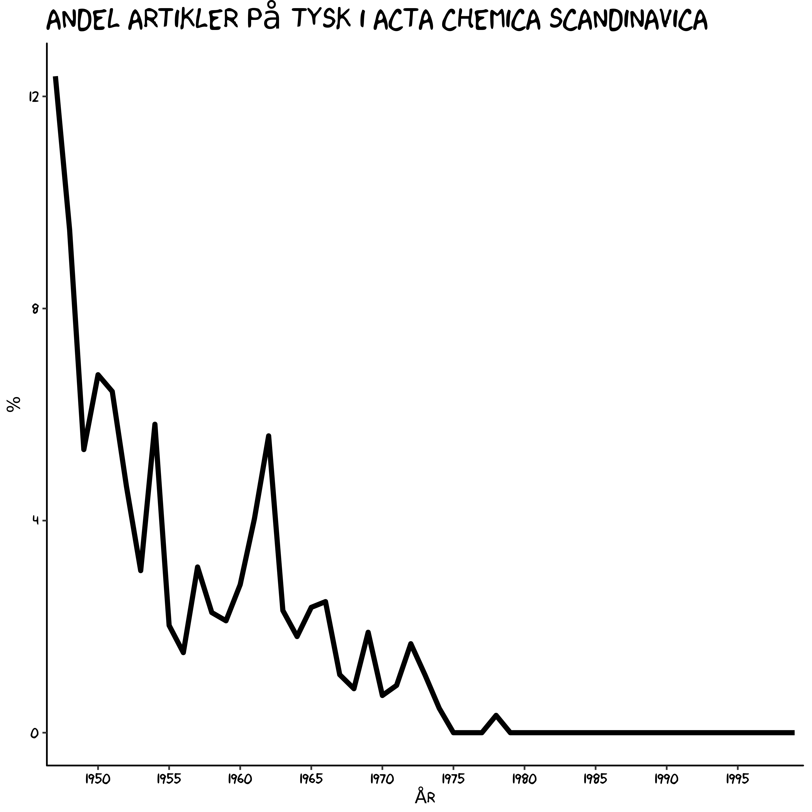

Åbne tidsskrift data
========================================================
author: Christian Knudsen
date: 
autosize: true

Hvorfor er det vigtigt
========================================================

Åbne data giver os mulighed for at besvare spørgsmål vi ellers ikke ville kunne besvare.

Derfor:

* En demonstration af hvordan det egentlig gøres


Meget primitivt
========================================================

Et simpelt videnskabshistorisk spørgsmål:

Der var engang hvor tysk var det dominerende sprog i kemien.

Det skiftede til engelsk.

Hvordan så det skift egentlig ud i de nordiske lande?


Acta Chemica Scandinavica
========================


Vi kan høste det hele 
====================


* Først laver vi en liste over de adresser vi skal hente data fra
* Så henter vi data - og her nøjes vi med årgang og artikeltitler
* Så regner vi ud hvilket sprog hver enkelt artikel er skrevet på

Og så ser vi resultatet

Listen med links
===========================================================
Ser således ud.


```
[1] "http://actachemscand.dk/volume.php?vol=1"
[2] "http://actachemscand.dk/volume.php?vol=2"
[3] "http://actachemscand.dk/volume.php?vol=3"
[4] "http://actachemscand.dk/volume.php?vol=4"
[5] "http://actachemscand.dk/volume.php?vol=5"
[6] "http://actachemscand.dk/volume.php?vol=6"
```

* Vi besøger hvert link, og henter data.
* Samtidig beder vi computeren gætte på hvilket sprog artiklen er skrevet på.

Lidt langhåret
===========================


```r
getPaperDetails <- function(paper, volid){
  title <- html_nodes(paper, "b") %>%
    html_text()
  title <- title[1]
  authors <- html_nodes(paper, "p") %>%
    html_text()
  pagesAndDOI <- html_nodes(paper, "div") %>%
    html_text()
  pages <- pagesAndDOI[1]
  pages <- substring(pages, 8, nchar(pages)-1)
  doi <- pagesAndDOI[2]
  doi <- substring(doi, 13, nchar(doi))
  language <- textcat(title)
  year <- acta[which(acta$url_id==volid),]$year
  volume <- acta[which(acta$url_id==volid),]$vol
  url_list <- paper %>% html_nodes("a") %>% html_attr("href")
  urls <- lapply(url_list, function(ch) grep("pdf", url_list))
  url <- url_list[urls[[1]]]
  
  result <- list(title=title, authors=authors, language=language, pages=pages, 
                 doi=doi, volume=volume, year=year, url=url)
}
```


Læring?
=====================================
* Hvis ikke vi sikrer adgang til metadata på ressourcerne - skal vores brugere gøre arbejdet.
* Endda noget ret bøvlet arbejde

En fin tabel
================================


```
                            authors language year
1     Astrup, Tage; Brodersen, Rolf  english 1947
2                        Foss, Olav  english 1947
3    Blom, Jakob; Rosted, Carl Olof  english 1947
4                      Veibel, Stig  english 1947
5                     Ågren, Gunnar  english 1947
6 Erdtman, Holger; Gripenberg, Jarl   german 1947
```


Nærmere kig
=======================

|Var1                |  Freq|
|:-------------------|-----:|
|afrikaans           |    26|
|albanian            |     2|
|basque              |    22|
|catalan             |   802|
|croatian-ascii      |     4|
|czech-iso8859_2     |     4|
|danish              |   282|
|dutch               |    28|
|english             | 29530|
|esperanto           |    38|
|estonian            |     4|
|finnish             |     8|
|french              |   134|
|frisian             |    56|
|german              |   622|
|indonesian          |     8|
|irish               |     8|
|italian             |     4|
|latin               |   324|
|lithuanian          |     4|
|manx                |     8|
|middle_frisian      |   106|
|portuguese          |    12|
|romanian            |   236|
|rumantsch           |    76|
|scots               |   156|
|scots_gaelic        |    24|
|serbian-ascii       |     2|
|slovak-ascii        |   300|
|slovak-windows1250  |     2|
|slovenian-iso8859_2 |    18|
|spanish             |    40|
|swedish             |    16|
|tagalog             |     6|
|welsh               |    72|

Læring 2
========================
* Kvaliteten af metadata i de ressourcer vi betaler for er rigtig vigtig!
* Er den ikke god nok - skal vores brugere lave arbejdet
* Og det er besværligt

Rensning af data
=========================

Det har jeg forberedt tidligere. For det er semimanuelt.


```

english  french  german 
  32378      54     552 
```

## Læring:

* Manglende adgang til metadata koster vores brugere tid.


Hvordan gik det så med tysk?
==========================================





Sidste læring
================================

* Fra at fylde ganske meget, gik tysk bort som kemisk sprog i de nordiske lande i 1978 og er ikke set siden.
* Åben adgang til data giver et kvantitativt svar på et interessant videnskabshistorisk spørgsmål.
* Var den åbne adgang bedre organiseret - ville vi have fået svaret lettere.

